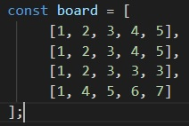
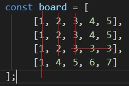
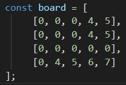
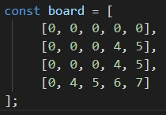

# Simple explanation
Here's a simple example:  
Let's say we've got that array from below:  

  

riddleSolver will find numbers that are repeating at least 3 times vertically or horizontally:  

  

And then changes it to zero (we read it as empty):  

  

After that it will drop all other numbers to the bottom:  

  

If after that appears to be more numbers that can be deleted, the function will run again.  
If not, the function will return the result.